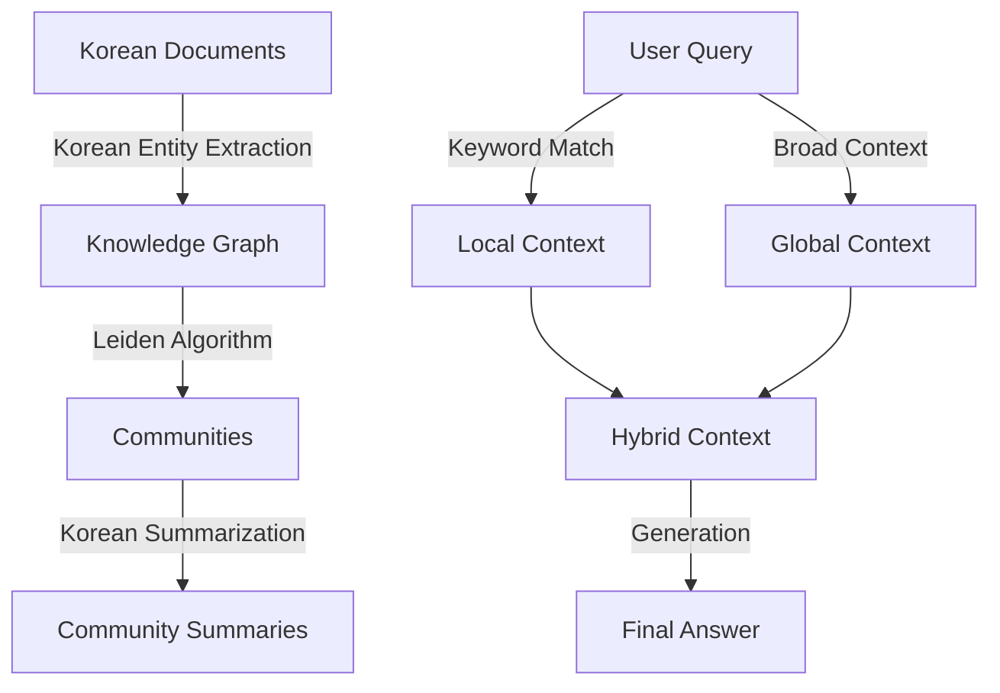

# Graph Retrieval-Augmented Generation V2 (GraphRAG v2)

**GraphRAG v2**는 기존 GraphRAG 모듈을 **한국어 환경과 정량적 평가(Quantitative Evaluation)**에 맞춰 대폭 개선한 고도화 버전입니다.

기존 버전(v1)이 구조적 기반(Leiden Community Detection, Global/Local Search)을 다지는 데 집중했다면, **v2는 실제 한국어 문서 처리 능력 강화와 Ragas 프레임워크를 도입한 신뢰성 있는 성능 측정**을 목표로 개발되었습니다.

---

## 🚀 Key Improvements in v2

### 1. 🇰🇷 Native Korean Graph Construction
- **문제점 (v1)**: 기존 프롬프트가 영어로 최적화되어 있어, 한국어 문서를 처리할 때도 영어로 요약되거나(Translation Loss), 한국어 엔티티가 영어로 번역되어 저장되는 문제(Entity Mismatch)가 발생했습니다.
- **해결책 (v2)**:
    - **Korean Prompts**: `extractor.py`, `community.py` 등 핵심 모듈의 모든 시스템 프롬프트(System Prompt)와 Pydantic 모델 설명을 **전면 한국어화**했습니다.
    - **Entity Preservation**: 엔티티 추출 시 "본문의 한국어 표기를 그대로 유지"하도록 강제하여 검색 정확도를 높였습니다.

### 2. 📊 Advanced Evaluation with Ragas
- **문제점 (v1)**: 6개의 소규모 수동 질문셋(QA Testset)으로는 모델의 일반적인 성능을 검증하기 어려웠습니다.
- **해결책 (v2)**:
    - **Automated Dataset Generation**: **Ragas** 프레임워크를 활용하여 문서 청크로부터 **100개의 고품질 QA 데이터셋**을 자동 생성하고 평가에 활용했습니다.
    - **Metrics**: `faithfulness`(사실 충실도)와 `answer_relevancy`(답변 관련성) 지표를 도입하여 객관적인 성능 수치를 확보했습니다.

---

## 🏗️ Architecture

기본적인 파이프라인(Build -> Community Detection -> Retrieve)은 v1의 검증된 아키텍처를 계승하되, **Prompt Engineering**과 **Evaluation Pipeline** 영역이 강화되었습니다.



---

## 📂 File Structure

```bash
src/graph_rag_v2/
├── builder.py              # 그래프 구축기 (NetworkX Integration)
├── extractor.py            # [Updated] 한국어 최적화 Entity/Relation 추출기
├── community.py            # [Updated] 한국어 커뮤니티 요약 생성기
├── retriever.py            # Local/Global/Hybrid 검색 엔진
├── detect_communities.py   # Leiden 알고리즘 기반 커뮤니티 탐지
├── evaluate_qa.py          # [New] Ragas 기반 100문항 자동 평가 스크립트
├── prepare_batch.py        # OpenAI Batch API 요청 생성
├── process_batch.py        # Batch 결과 처리 및 그래프 업데이트
└── test_retrieval.py       # 검색 기능 테스트
```

---

## 📊 Performance Benchmark (v2)

**Ragas**를 사용하여 생성된 100개의 테스트 데이터셋에 대한 **Graph Hybrid Search** 성능 평가 결과입니다.

| Mode | Avg Latency (s) | Faithfulness | Answer Relevancy |
| :--- | :---: | :---: | :---: |
| **Graph Hybrid (v2)** | **26.29s** | **0.75** | **0.16** |

> **📝 Analysis**:
> - **Faithfulness (0.75)**: 100개의 다양한 질문에서도 0.75 수준의 높은 사실 충실도를 기록했습니다. 이는 한국어 그래프 구축이 성공적으로 이루어져 환각(Hallucination)이 억제되고 있음을 시사합니다.
> - **Answer Relevancy (0.16)**: 상대적으로 낮은 관련성 점수는 생성된 답변이 질문의 의도와 다소 빗나가거나 너무 장황할 수 있음을 나타냅니다. 향후 Global Search의 Summarization 프롬프트를 다듬어 개선할 예정입니다.
> - **Latency (26.29s)**: Hybrid Search 특성상 Local과 Global 검색을 모두 수행하므로 시간이 소요되나, 심층적인 답변을 위해 감수할 만한 수준입니다.

---

## 🛠️ Usage

### 1. Basic Retrieval Test
```bash
# 기본 검색 테스트
python -m src.graph_rag_v2.test_retrieval
```

### 2. Run Evaluation
Ragas를 이용한 전체 벤치마크 실행 (데이터셋 생성 및 평가 포함):
```bash
python -m src.graph_rag_v2.evaluate_qa
```
