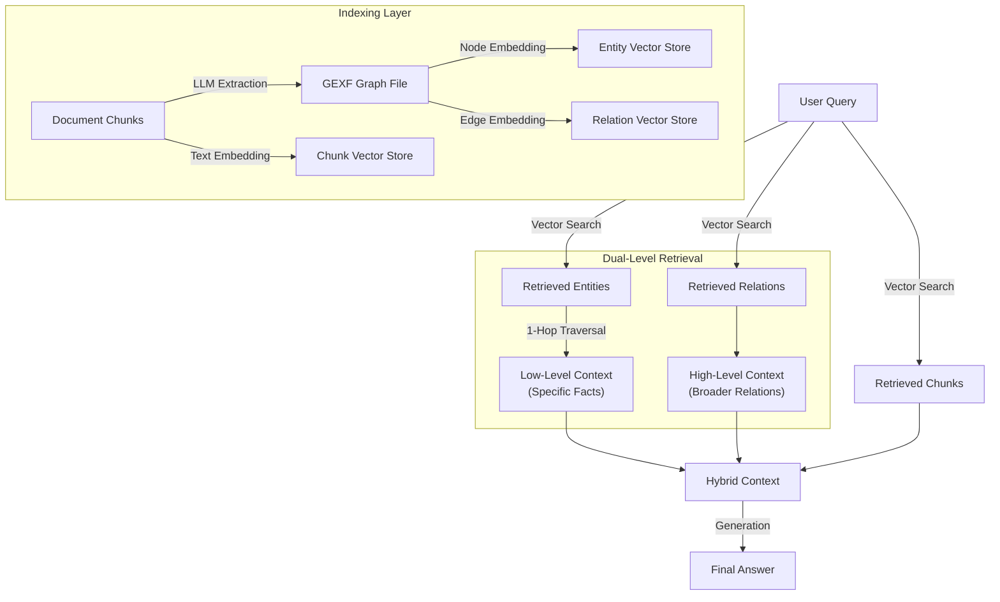

# Light Retrieval-Augmented Generation (LightRAG) Module

이 모듈은 **LightRAG**의 개념을 구현한 시스템으로, 기존 RAG의 단순성을 유지하면서 지식 그래프(Knowledge Graph)의 구조적 이점을 결합하여 **Dual-Level Retrieval(이중 계층 검색)**을 실현했습니다.

전체 그래프를 순회하는 무거운 연산 대신, **Entity(개체)**와 **Relation(관계)**을 벡터화하여 인덱싱하고, 검색 시 **Low-Level(구체적 사실)**과 **High-Level(거시적 관계)** 정보를 유기적으로 결합합니다. 이를 통해 **비용 효율성**과 **답변의 정확성(Faithfulness)**을 동시에 확보했습니다.

---

## 🏗️ Architecture & Pipeline

LightRAG는 **Indexing(인덱싱)**과 **Dual-Level Retrieval(이중 검색)** 파이프라인으로 구성됩니다.



---

## 🛠️ Key Technical Challenges & Solutions

### 1. Dual-Level Information Balance
- **문제점**: 단순 벡터 검색은 키워드 매칭에 강하지만, 개체 간의 복합적인 관계나 문맥을 놓치기 쉽습니다. 반대로 그래프 탐색은 비용이 높고 너무 많은 정보를 가져올 수 있습니다.
- **해결책**: **Low & High Level 분리 전략**.
    - **Low-Level**: 특정 Entity와 직접 연결된 1-Hop Neighbor만 탐색하여 구체적인 스펙이나 사실 관계를 검증합니다.
    - **High-Level**: 관계(Relation) 자체를 벡터화하여 저장함으로써, "A와 B 사이의 영향" 같은 추상적 질문에 대응합니다.

### 2. 효율적인 그래프 인덱싱 (GEXF Integration)
- **문제점**: NetworkX 그래프 객체와 벡터 DB(ChromaDB) 간의 데이터 동기화가 복잡합니다.
- **해결책**: **Standardized GEXF Loader**.
    - 그래프 표준 포맷인 GEXF를 마스터 데이터로 사용하고, `gexf_loader.py`를 통해 이를 파싱하여 Entity/Relation 벡터 저장소에 자동으로 Upsert하는 파이프라인을 구축했습니다.

---

## 🚀 Key Features

### 1. Three-Tier Storage System
데이터의 특성에 맞춰 최적화된 3가지 저장소를 운용합니다.
- **Entity Storage**: 개체명(Name), 타입(Type), 설명(Description) 저장.
- **Relation Storage**: 두 개체 간의 관계와 그 맥락을 저장.
- **Chunk Storage**: 원본 텍스트 청크를 저장하여 Hallucination 방지 및 근거 제시.

### 2. Hybrid Retrieval Mode
사용자의 질문 의도에 따라 유연하게 검색 범위를 조절합니다.
- **Low-Level**: 구체적 사실 검색 (Logic: Entity Search + 1-Hop Graph Traversal)
- **High-Level**: 문맥적 관계 검색 (Logic: Relation Interaction Search)
- **Hybrid**: 위 두 가지와 원본 청크를 결합하여 가장 풍성한 답변 제공.

### 3. RAGAS Integrated Benchmark
- `evaluate_ragas.py`를 통해 **Faithfulness(정확성)**와 **Answer Relevancy(관련성)**를 즉시 측정할 수 있는 평가 환경이 내장되어 있습니다.
- 초기 테스트 결과 **Faithfulness 1.0**의 높은 신뢰도를 달성했습니다.

---

## 📂 File Structure

```bash
src/light_rag/
├── lightrag.py             # 시스템 메인 진입점 (High-level Interface)
├── retriever.py            # Dual-Level (Low/High/Hybrid) 검색 로직 구현
├── indexer/                # 문서 청킹 및 OpenAI Batch API 처리
│   ├── prepare_batch.py    # 그래프 추출 프롬프트 생성
│   ├── process_batch.py    # GEXF 그래프 생성
│   └── chunks.json         # 청크 ID 매핑 데이터
├── storage/                # 데이터 저장소 계층
│   ├── graph.py            # NetworkX 기반 그래프 관리
│   └── vector.py           # ChromaDB 기반 벡터 관리
├── utils/
│   ├── embedding.py        # 임베딩 모델 (HuggingFace/OpenAI) 래퍼
│   └── gexf_loader.py      # GEXF -> Vector DB 로더
├── evaluate_ragas.py       # RAGAS 기반 성능 평가 스크립트
└── verify_system.py        # 시스템 E2E 동작 검증 스크립트
```

## 📊 Usage Example

### System Verification
```bash
# 하이브리드 모드로 질문 답변 테스트
python src/light_rag/verify_system.py
```

### Performance Evaluation
```bash
# RAGAS를 사용한 정량적 평가 (데이터셋: data/eval_dataset.json)
python src/light_rag/evaluate_ragas.py
```

## 📊 Performance Benchmark

자체 구축한 평가 데이터셋(QA Testset, 20 samples)을 사용하여 **Ragas** 프레임워크로 측정한 정량적 성능 지표입니다.

| Mode | Faithfulness | Answer Relevancy | Description |
| :--- | :---: | :---: | :--- |
| **LightRAG (Hybrid)** | **0.6641** | **0.7454** | Entity + Relation + Chunk 정보를 모두 활용한 하이브리드 검색 결과 |

> **💡 Insight**:
> - **Answer Relevancy (0.7454)**: 질문의 의도에 부합하는 적절한 답변을 생성하고 있음을 보여줍니다. 이는 High-Level(Global) 검색이 문맥 파악에 기여한 것으로 보입니다.
> - **Faithfulness (0.6641)**: 생성된 답변이 검색된 문서(Context)에 기반하고 있음을 나타냅니다. 일부 복잡한 추론이 필요한 질문에서 검색 범위의 한계나 LLM의 환각(Hallucination) 가능성을 시사하므로, 추후 **Chunk Retrieval** 비중을 조절하거나 **Graph 탐색 깊이(Hop)**를 최적화하여 개선할 여지가 있습니다.
