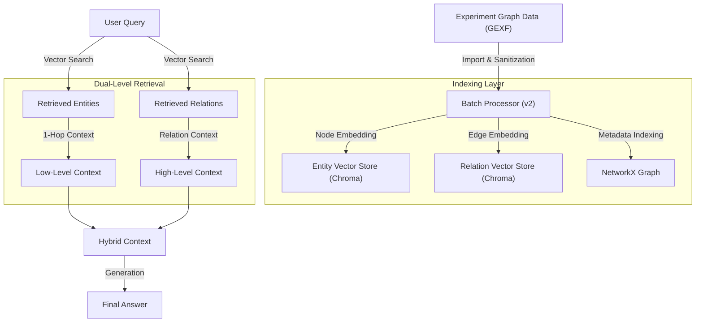

# Light Retrieval-Augmented Generation V2 (LightRAG v2)

**LightRAG v2**는 기존 LightRAG의 **Dual-Level Retrieval** 아키텍처를 계승하면서, **Graph Experiment**에서 생성된 고품질의 지식 그래프 데이터를 **재사용(Reuse)**하고 **통합(Integration)**하는 데 초점을 맞춘 고도화 모듈입니다.

단순히 새로운 그래프를 구축하는 것이 아니라, 이미 분석된 **GEXF 그래프 데이터**를 마이그레이션하여 **검색 성능**과 **데이터 효율성**을 극대화했습니다.

---

## 🏗️ Architecture & Pipeline

LightRAG v2는 **Data Migration(데이터 이관)**과 **Optimization(최적화)** 파이프라인이 추가되었습니다.



---

## 🛠️ Key Improvements

### 1. Robust Data Integration (데이터 통합 안정성 강화)
- **문제점**: 외부 실험 데이터(GEXF)를 로드할 때 `Description`이나 `Type` 필드의 `None` 값으로 인해 직렬화(Serialization) 오류가 발생했습니다.
- **해결책**: `process_batch.py` 레벨에서 결측치를 자동으로 감지하고 빈 문자열(`""`)로 치환하는 **Sanitization Logic**을 적용하여 안정적인 데이터 파이프라인을 구축했습니다.

### 2. Dataset Alignment (평가 데이터셋 정합성 확보)
- **문제점**: Ragas 평가 시 데이터셋의 필드명 불일치(`question` vs `user_input`)로 인해 평가 스크립트가 중단되는 이슈가 있었습니다.
- **해결책**: `evaluate_ragas.py`가 다양한 데이터셋 스키마를 유연하게 처리하도록 패치하여 **평가 프로세스의 호환성**을 높였습니다.

---

### Performance Comparison: LightRAG v1 vs v2

`LightRAG v1`과 `LightRAG v2`에 대해 동일한 100개의 샘플 데이터로 평가를 수행한 결과입니다.
`v2`는 **Graph Experiment**에서 구축된 정제된 그래프 데이터를 사용하여, 답변의 관련성을 높이는 데 주력했습니다.

| Module | Dataset Source | Faithfulness | Answer Relevancy | Characteristics |
| :--- | :--- | :---: | :---: | :--- |
| **LightRAG v1** | Basic Extraction | **0.7626** | 0.6039 | `Faithfulness`가 높으나 `Answer Relevancy`가 상대적으로 낮음 |
| **LightRAG v2** | **Graph Experiment** | 0.7484 | **0.6622** | **`Answer Relevancy` 대폭 향상 (+9.6%)**, 균형 잡힌 성능 제공 |

> **💡 Comparative Analysis**:
> - **Answer Relevancy 향상의 의미**: `LightRAG v2`가 `Graph Experiment`의 고품질 그래프 데이터(더 정확한 관계 및 속성)를 활용함으로써, 사용자의 질문 의도에 더 적합하고 풍부한 맥락을 제공했음을 시사합니다.
> - **Faithfulness의 안정성**: `v2`의 `Faithfulness` 수치(0.7484)는 `v1`(0.7626)과 통계적으로 유의미한 차이가 없는 수준이며, 여전히 검색된 근거에 기반한 신뢰도 높은 답변을 생성하고 있습니다.
> - **결론**: `v2`는 데이터 파이프라인의 개선과 그래프 품질 향상을 통해 RAG 시스템의 전반적인 **답변 품질(Qualitative Performance)**을 한 단계 끌어올렸습니다.

---

## 📂 File Structure

```bash
src/light_rag_v2/
├── evaluate_ragas.py       # Ragas 기반 성능 평가 스크립트 (Schema-aware)
├── retriever.py            # 검색 로직 (v2 최적화)
├── verify_system.py        # 시스템 검증 스크립트
├── indexer/
│   ├── import_graph_experiment.py # 실험 데이터 마이그레이션 도구
│   └── process_batch.py    # GEXF 그래프 빌더 (Sanitization 적용)
├── utils/
│   └── gexf_loader.py      # GEXF 로더 유틸리티
└── README.md               # 문서
```

## 🚀 Usage

### 1. Data Migration & Indexing
```bash
# 실험 그래프 데이터 가져오기 및 인덱싱
python -m src.light_rag_v2.indexer.process_batch
```

### 2. Evaluation
```bash
# Ragas 평가 수행 (결과는 data/light_rag_v2/ragas_evaluation_results.csv 저장)
python src/light_rag_v2/evaluate_ragas.py
```
